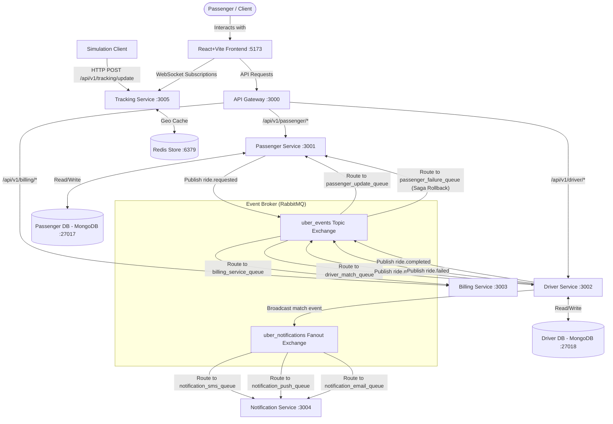

# 🚗 Mini Uber Microservices Infrastructure

A lightweight, containerized microservices ecosystem demonstrating an event-driven architecture. The project utilizes an **API Gateway** for request routing, **RabbitMQ** for event choreography and pub/sub messaging, **MongoDB** for database-per-service storage isolation, **Redis** for geospatial telemetry caching, **WebSockets (Socket.io)** for real-time tracking, a distributed **Saga Pattern** for transactional rollback/compensation logic, and a React-based **Frontend Dashboard**.

---

## 🏗️ System Architecture

This project is built around six decoupled microservices, three infrastructure components (databases, cache & message broker), a simulation client, and an interactive frontend dashboard.



### Microservices & Components
1. **API Gateway** (`port 3000`): The single entry point for clients. Routes requests dynamically to downstream services and rewrites request paths:
   - `/api/v1/passenger/*` → Passenger Service (`port 3001`)
   - `/api/v1/driver/*` → Driver Service (`port 3002`)
   - `/api/v1/billing/*` → Billing Service (`port 3003`)
2. **Passenger Service** (`port 3001`): Handles ride requests, writes state to its isolated `passenger_db`, publishes matching triggers to RabbitMQ, and listens for status updates (match accepted/failed/completed).
3. **Driver Service** (`port 3002`): Manages driver states and matches available drivers. Port mappings are decoupled from host configurations to allow seamless horizontal scaling. Dynamically seeds 10 drivers (`d1` to `d10`) on startup.
4. **Billing Service** (`port 3003`): Listens for completed trips via RabbitMQ, computes the final fare (`₹50 base fare + ₹12/km`), records paid invoices in an in-memory ledger, and exposes a GET `/invoices` API.
5. **Notification Service** (`port 3004`): Employs a **Fanout Exchange** to route trip-match notifications to three concurrent channels: SMS, Push notifications, and Email dispatchers.
6. **Tracking Service** (`port 3005`): Ingests high-frequency GPS telemetry, updates driver geospatial indexes in Redis (`mini_uber_redis`), and broadcasts live coordinate movements to frontend clients using WebSockets.
7. **Infrastructure Services**:
   - `passenger_db` (`port 27017`): MongoDB instance storing Passenger ride requests.
   - `driver_db` (`port 27018`): MongoDB instance storing Driver profiles and real-time occupancy.
   - `mini_uber_redis` (`port 6379`): Redis instance utilized as an in-memory geospatial cache.
8. **React/Vite Frontend** (`port 5173`): An interactive, real-time control center that showcases service health statuses, allows booking rides, dynamic driver registration, manual trip completion, invoice ledgers, and a real-time Leaflet map tracking drivers dynamically.
9. **Simulation Client**: Telemetry generation client that simulates Mumbai driving routes for all 10 drivers, pinging coordinate feeds into the tracking microservice.

---

## ⚡ Distributed Saga Pattern (Event Choreography)

In distributed architectures, ensuring data consistency without synchronous blocking calls is crucial. This system implements an event-driven **Saga Pattern** with compensating transactions:

### 🟢 1. The Success Scenario
1. **Request Ride**: A passenger requests a ride via the API Gateway. The Passenger Service saves the request to `passenger_db` as `PENDING` and publishes a `ride.requested` event to RabbitMQ.
2. **Driver Allocation**: The Driver Service consumes `ride.requested`. It checks its DB for an `AVAILABLE` driver (e.g., `d1`), marks them `BUSY` atomically, and publishes a `ride.matched` event.
3. **Notification**: Concurrently, the Driver Service publishes a broadcast event to the `uber_notifications` fanout exchange. The SMS, Push, and Email workers in the Notification Service consume it simultaneously.
4. **State Transition**: The Passenger Service consumes `ride.matched` and updates the ride's status to `ACCEPTED` with the assigned `driverId` in `passenger_db`.
5. **Trip Completion**: Once the trip concludes (e.g. via the driver's action or dashboard), the Driver Service marks the driver `AVAILABLE` and publishes a `ride.completed` event containing randomized trip distance.
6. **Billing**: The Billing Service consumes `ride.completed`, runs the pricing algorithm, and records a paid invoice.
7. **Saga End State**: The Passenger Service consumes `ride.completed` and marks the ride status as `COMPLETED`.

### 🔴 2. The Compensation/Failure Scenario
1. **Request Ride**: A passenger requests a ride. The Passenger Service writes `PENDING` to `passenger_db` and publishes `ride.requested`.
2. **No Drivers Available**: The Driver Service consumes the event but finds all drivers are currently `BUSY`.
3. **Emit Failure Event**: The Driver Service publishes a `ride.failed` event indicating driver allocation failed.
4. **Compensating Rollback**: The Passenger Service consumes `ride.failed` and executes a compensating transaction, updating the ride status in `passenger_db` from `PENDING` to `FAILED`. This rolls back the distributed transaction safely.

---

## 🛠️ Tech Stack
- **Runtime**: Node.js (Express framework)
- **Database**: MongoDB (Mongoose ODM)
- **Cache**: Redis (`redis` NPM package)
- **Message Broker**: RabbitMQ (`amqplib`)
- **Real-Time Stream**: Socket.io
- **Frontend**: React, Vite, TailwindCSS (for UI structure), Leaflet (Maps)
- **Containerization**: Docker & Docker Compose

---

## 🚀 Getting Started

### Prerequisites
Make sure you have the following installed on your host:
- [Docker & Docker Compose](https://www.docker.com/products/docker-desktop)
- [Node.js](https://nodejs.org/) (for running the frontend and simulation client locally)

### 1. Booting the Backend Infrastructure
To spin up all backend microservices, databases, Redis, and RabbitMQ:
1. Navigate to the `infrastructure` folder:
   ```bash
   cd infrastructure
   ```
2. Boot the containers:
   ```bash
   docker-compose up --build
   ```
3. **Verification**:
   - **RabbitMQ Console**: [http://localhost:15672](http://localhost:15672) (User: `guest`, Pass: `guest`)
   - **API Gateway Health**: [http://localhost:3000/gateway-health](http://localhost:3000/gateway-health)
   - **Tracking Service**: [http://localhost:3005/health](http://localhost:3005/health)

### 2. Booting the React Dashboard
1. Navigate to the `frontend` folder:
   ```bash
   cd frontend
   ```
2. Install dependencies:
   ```bash
   npm install
   ```
3. Run the Vite development server:
   ```bash
   npm run dev
   ```
4. Access the dashboard in your browser at [http://localhost:5173](http://localhost:5173).

### 3. Running the Telemetry Simulation
To start streaming live driver telemetry into the system:
1. Navigate to the `simulation-client` folder:
   ```bash
   cd simulation-client
   ```
2. Install dependencies:
   ```bash
   npm install
   ```
3. Start the simulator:
   ```bash
   node simulate.js
   ```
   You will see console output showing coordinates being dispatched for 10 drivers.

---

## 📖 API & Testing Guide

### Live Map Tracking Verification
1. Open the frontend dashboard at [http://localhost:5173](http://localhost:5173).
2. Start the simulation client (`node simulate.js`).
3. View the map on the **Overview** page. You will see 10 neon cyan taxi markers moving along simulated coordinates in real-time as coordinates are ingestion-cached in Redis and broadcasted via WebSockets.

### Simulating a Ride Lifecycle
1. **Book a Ride**: Use the booking form on the dashboard (or send a POST to `http://localhost:3000/api/v1/passenger/rides/request`).
2. **Observe Matching**: The system matches the request to the first available driver (e.g. `d1`). In the dashboard, the card status updates from `PENDING` to `ACCEPTED`, and notifications dispatch logs.
3. **Complete the Ride**: Use the completion panel on the dashboard (or send a POST to `http://localhost:3000/api/v1/driver/rides/complete` with the `requestId` and matched `driverId`).
4. **Billing Generation**: Observe that the driver is marked `AVAILABLE` again, the Billing Service generates a paid invoice (visible in the **Invoices** tab), and the passenger service marks the ride status as `COMPLETED`.

---

## 📂 Project Directory Structure

```text
mini-uber-microservice/
├── services/
│   ├── api-gateway/            # Express proxy server acting as entry point (Port 3000)
│   ├── passenger-service/      # API for ride requests & DB status tracking (Port 3001)
│   ├── driver-service/         # Algorithm for matching drivers & completing trips (Port 3002)
│   ├── billing-service/        # Event handler calculating trip fares (Port 3003)
│   ├── notification-service/   # Multi-channel notification workers (fanout) (Port 3004)
│   └── tracking-service/       # Telemetry ingestion & WebSocket live stream (Port 3005)
├── frontend/                   # React + Vite dashboard displaying maps & metrics (Port 5173)
├── simulation-client/          # Telemetry generator simulating driver movement
├── infrastructure/
│   └── docker-compose.yml      # Orchestration definition for containers, DBs, RabbitMQ, Redis
└── SystemDesign.excalidraw     # Open with excalidraw.com to view diagram
```
